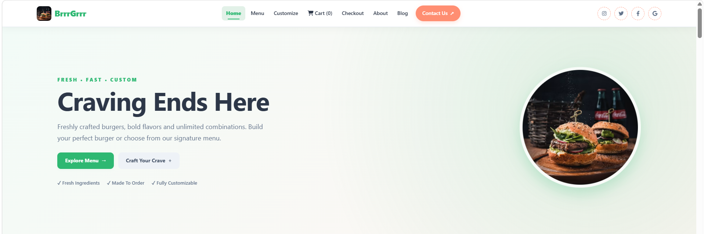
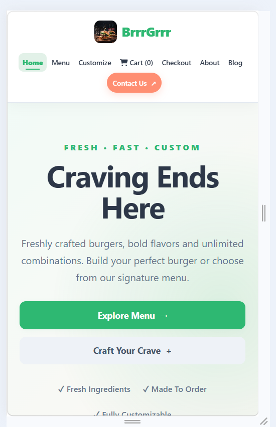

# 🍔 BrrrGrrr — Full-Stack Burger Website

BrrrGrrr is a full-stack burger website built as an internship project. It combines a responsive burger ordering interface with a community blog, user authentication, and backend APIs.

## ✨ Features

### 🍔 Burger Website
- Responsive homepage and navigation
- Burger/menu browsing
- Burger search
- Cart functionality
- Responsive mobile layout
- Clean, modern burger-themed UI

### 📝 Blog
- Browse community blog posts
- Search posts by title, content, or author
- User sign-up and login
- Logout functionality
- Create and manage blog posts
- Blog post data handled through the backend API

### 🔐 Authentication
- User registration
- User login
- Authentication token handling
- Protected blog functionality
- Logout support

### 📱 Responsive Design
The website is designed to work across desktop, tablet, and mobile devices.

## 🛠️ Tech Stack

### Frontend
- HTML5
- CSS3
- JavaScript
- Responsive design
- Font Awesome icons

### Backend
- Node.js
- Express.js
- REST API
- JavaScript

### Data / Storage
- JSON data
- DOCX/XLSX project data files
- Backend models and services

## 📁 Project Structure

```text
BrrrGrrr/
│
├── backend/
│   ├── controllers/
│   │   ├── authController.js
│   │   └── postController.js
│   │
│   ├── data/
│   │   ├── blog_posts.docx
│   │   ├── posts.json
│   │   ├── README.txt
│   │   └── users.xlsx
│   │
│   ├── models/
│   │   ├── Post.js
│   │   └── User.js
│   │
│   ├── public/
│   │   ├── app.js
│   │   ├── blog.html
│   │   ├── blog.js
│   │   ├── index.html
│   │   └── style.css
│   │
│   ├── routes/
│   ├── services/
│   ├── package.json
│   ├── package-lock.json
│   └── server.js
│
├── screenshots/
│   ├── homepage.png
│   ├── homepage-mobile.png
│   ├── menu.png
│   └── blog.png
│
├── .gitignore
└── README.md
```

## 🚀 Getting Started

### 1. Clone the repository

```bash
git clone YOUR_GITHUB_REPOSITORY_URL
cd BrrrGrrr
```

### 2. Install backend dependencies

Open a terminal inside the `backend` folder:

```bash
cd backend
npm install
```

### 3. Start the server

```bash
npm start
```

If your project uses a different development script:

```bash
npm run dev
```

### 4. Open the website

Open the local URL configured by your server.

For example:

```text
http://localhost:5001
```

## 🔌 API

The backend provides REST API functionality for authentication, users, and blog posts.

The frontend communicates with the backend through the API.

## 📸 Screenshots

### Homepage



### Mobile Homepage



### Menu


### Blog


> Make sure the filenames above match the actual files inside the `screenshots` folder.

## 📱 Responsive Preview

The project can be tested using Chrome DevTools device emulation to preview the website at mobile screen sizes.

## 🔐 Environment Variables

If the backend uses environment variables or secrets, keep them in a local `.env` file and do not commit that file to GitHub.

Example:

```env
PORT=5001
```

Add any other project-specific configuration required by the backend.

## 🌐 Deployment

Before deployment, update frontend API URLs that still point to localhost.

For example:

```javascript
const API_BASE_URL = "http://localhost:5001/api";
```

should be changed to the production backend URL when deploying.

Also make sure production storage is configured appropriately for any data that must persist after deployment.

## 🧪 Testing Checklist

- [ ] Homepage loads correctly
- [ ] Navigation links work
- [ ] Burger search works
- [ ] Cart works
- [ ] Blog page loads
- [ ] Blog search works
- [ ] Sign-up works
- [ ] Login works
- [ ] Logout works
- [ ] Protected blog actions require authentication
- [ ] Mobile layout works
- [ ] No console errors
- [ ] Production API URL is configured
- [ ] Secrets are not committed to GitHub

## 👩‍💻 Project

**BrrrGrrr**  
Full-Stack Burger Website & Community Blog

Built as an internship project.
"# BrrrGrrr" 
